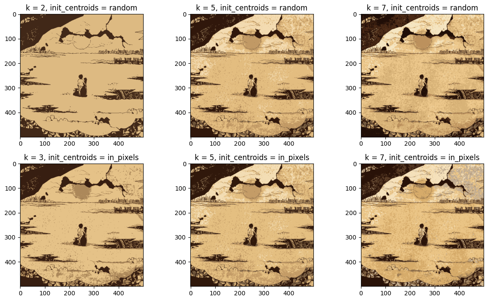

# Color Compression with K-means clustering and numpy

- Project from HCMUS's 2023 Applied Mathematics and Statistics course.
- ***Disclaimer: This program only supports `RGB` color model.*** Others such as `RGBA`, `CMYK`, or `HSL`, etc. might produce questionable results or not work at all.

## Content

- `lab02_project01.ipynb` contains all the tasks and requirements of the project.
- `Report.pdf` includes my documentation for K-means clustering and all the required tasks.
- `sample` folder holds the pictures that were used during implementation and documentation.

### `ColorCompressionKMeans.ipynb`

- My implementation of K-means does **NOT** guarantee that each cluster will contain at least one pixel, i.e., ***empty clusters can exist***.
  - An empty cluster indicates that ***its centroid has no pixel sharing its color***, and the mean cannot be computed. ***Such centroids should be discarded to not affect further calculations***.
  - Therefore, ***we will not always get the number of clusters `k_clusters` we actually want in the output.*** This is much more prevalent when dealing with `init_centroids=random`.

### `ColorCompressionKMeans_v1.ipynb`

- ***Variant 1 is experimental, it aims to replace the discarded centroids by generating new centroids on the spot.***
  - The runtime will be truly terrible if luck is not on your side.

## Getting Started

### Prerequisites

- Any IDE, preferably VSCode.
- Python 3.11 and Jupyter package.
  - Alternatively, the `.ipynb` file can be run on Google Colab or Anaconda.
- Everything from the `Import libraries and essential functions` section of the notebook.

### Installation

- Clone the repo.

## Usage

- **Make sure `Import libraries and essential functions` is run at least once.**
- **Inputs are handled very extensively**. So long as the `img` file is correct, the program will safely execute.
  - **`img.jpg`** - All available renditions of the img will be output, i.e., the img will be run through the 3 default `k_clusters`s, each one has 2 `init_centroids` methods.
  - **`img.png 10`** - All renditions of the img with `k_clusters=10` and each default `init_centroids` method will be output.
  - **`img.jpg 7 1`** - The rendition of the img with `k_clusters=7` and `init_centroids=in_pixels` will be output.
- As for saving, 2 supported filetypes are `.png` and `.pdf`.
  - *To opt out of saving, either leave the input `blank` or mess it up.*

## Built With

[vscodeicon]: https://skillicons.dev/icons?i=vscode&theme=dark
[vscodeurl]: https://code.visualstudio.com/

[pythonicon]: https://skillicons.dev/icons?i=py&theme=dark
[pythonurl]: https://www.python.org/

[jupytericon]: https://cdn.jsdelivr.net/gh/devicons/devicon/icons/jupyter/jupyter-original-wordmark.svg
[jupyterurl]: https://code.visualstudio.com/docs/datascience/jupyter-notebooks

[windowsicon]: https://cdn.jsdelivr.net/gh/devicons/devicon/icons/windows8/windows8-original.svg
[windowsurl]: https://www.microsoft.com/en-us/windows/

| [![VSCode][vscodeicon]][vscodeurl] | [![Python][pythonicon]][pythonurl] | [![Jupyter][jupytericon]][jupyterurl] | [![Windows][windowsicon]][windowsurl] |
| :-: | :-: | :-: | :-: |
| 1.80.0 | 3.11.4 | VSCode | &nbsp;&nbsp; 11 &nbsp;&nbsp; |

(<a href="#readme-top">back to top</a>)

